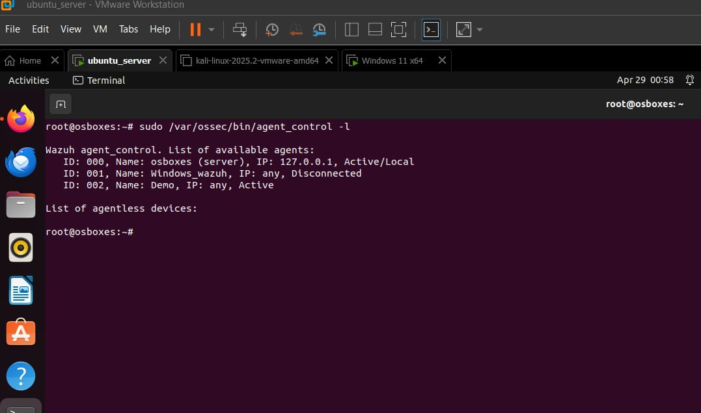
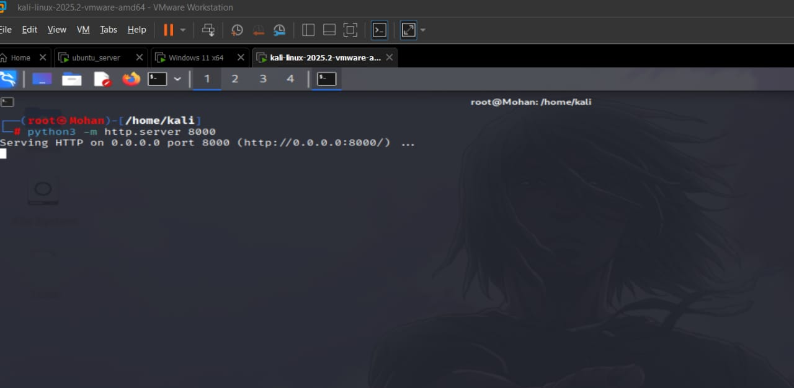
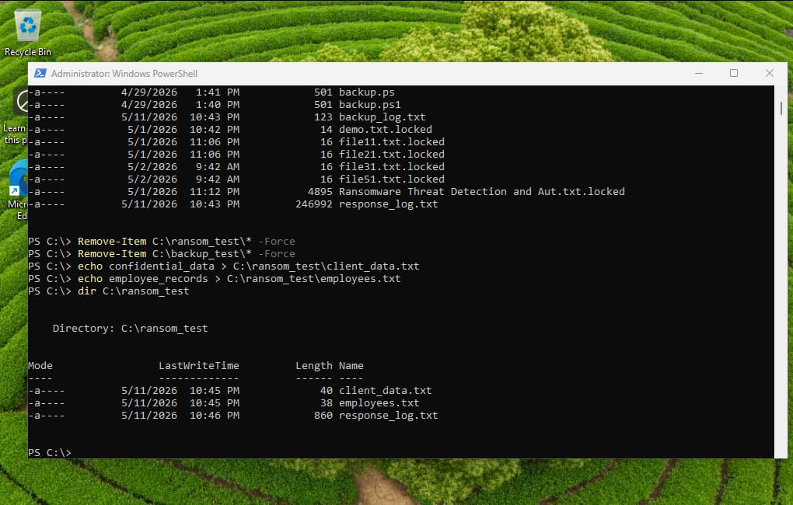
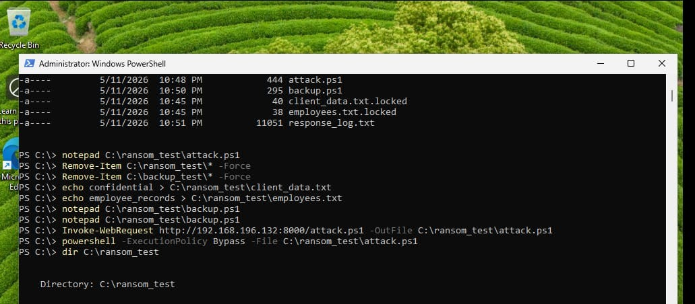
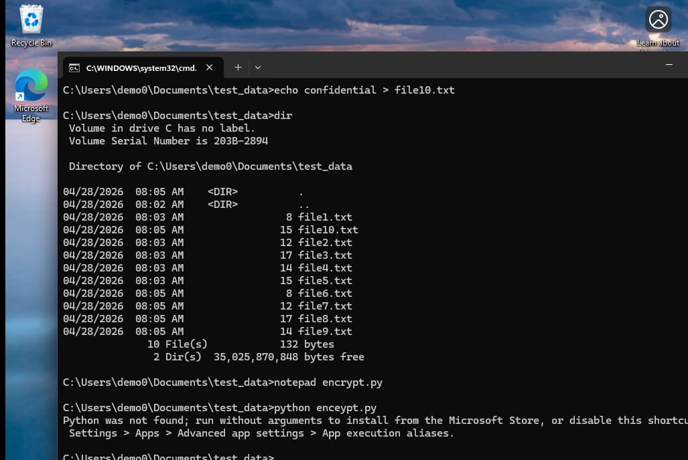

# 🛡️ Ransomware Threat Detection and Automated Response System using Wazuh SIEM

## 📌 Project Overview

This project demonstrates the design and implementation of an intelligent ransomware detection and automated response system using Wazuh SIEM. The lab environment was built using Ubuntu Server, Windows 11, and Kali Linux in VMware Workstation.

The objective of this project is to detect ransomware activities, monitor endpoint behavior, generate real-time security alerts, and automatically respond to suspicious events using PowerShell automation and Python scripts.

---

## 🎯 Objectives

- Detect ransomware behavior in real time.
- Monitor Windows endpoints using Wazuh Agent.
- Generate security alerts for suspicious activities.
- Perform SHA-256 file integrity monitoring.
- Detect abnormal CPU utilization.
- Send Telegram notifications during attacks.
- Automatically isolate compromised systems.
- Simulate ransomware safely in a virtual lab.

---

## 🏗️ Lab Environment

| Machine | Purpose |
|----------|----------|
| Ubuntu Server | Wazuh Manager |
| Windows 11 | Victim Machine |
| Kali Linux | Attack Machine |
| VMware Workstation | Virtualization Platform |

---

## 🛠️ Technologies Used

- Wazuh SIEM
- Ubuntu Server
- Windows 11
- Kali Linux
- VMware Workstation
- PowerShell
- Python
- SHA-256 File Integrity Monitoring
- Active Response
- Telegram Bot API
- MITRE ATT&CK Framework
- Windows Event Logs

---

## ✨ Features

- Real-time ransomware detection
- Endpoint monitoring using Wazuh
- SHA-256 file integrity verification
- CPU usage monitoring
- Telegram alert notifications
- Automated network isolation
- Security log analysis
- Safe ransomware simulation

---

## 📂 Project Structure

```
docs/
    Project_Report.pdf

screenshots/
    (Project Screenshots)

scripts/
    PowerShell Scripts
    Python Scripts

README.md
LICENSE
```

---

## 🔄 Project Workflow

1. Configure Wazuh Manager on Ubuntu Server.
2. Connect Windows endpoint using Wazuh Agent.
3. Simulate ransomware attack from Kali Linux.
4. Detect malicious activities using Wazuh SIEM.
5. Monitor CPU utilization and file integrity.
6. Generate Telegram alerts.
7. Automatically isolate the compromised endpoint.
8. Analyze alerts through the Wazuh Dashboard.

---

## 📸 Screenshots

Project screenshots will be uploaded soon.
---

# 📸 Project Screenshots

## 1. Wazuh Dashboard Overview


---

## 2. Wazuh Agent Status



---

## 3. Kali HTTP Server



---

## 4. Ransom Test Setup



---

## 5. Ransomware Attack Execution



---

## 6. Encrypted (.locked) Files


---

## 7. Backup Recovery


---

## 8. File Integrity Monitoring



---

## 🚀 Future Enhancements

- Email alert integration
- Machine learning-based ransomware detection
- Cloud SIEM integration
- Endpoint forensic analysis
- Threat intelligence integration

---

## ⚠️ Disclaimer

This project was developed in a controlled virtual lab environment for educational and research purposes only. No real systems were targeted.

---

## 👨‍💻 Author

**Mohan Sekar**

Cyber Security | SOC Analyst | Blue Team | Wazuh SIEM | Incident Response

GitHub:
https://github.com/Mohan-161
