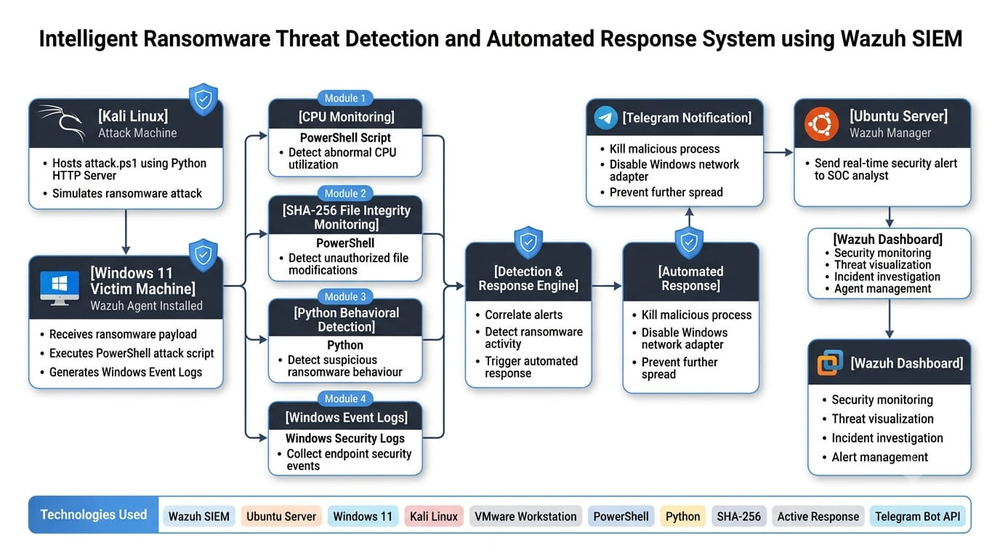
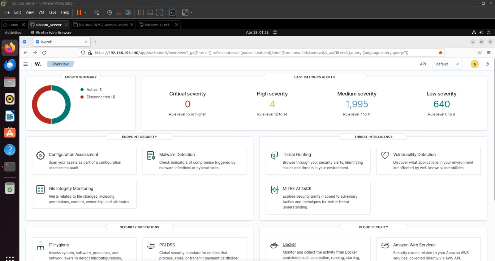
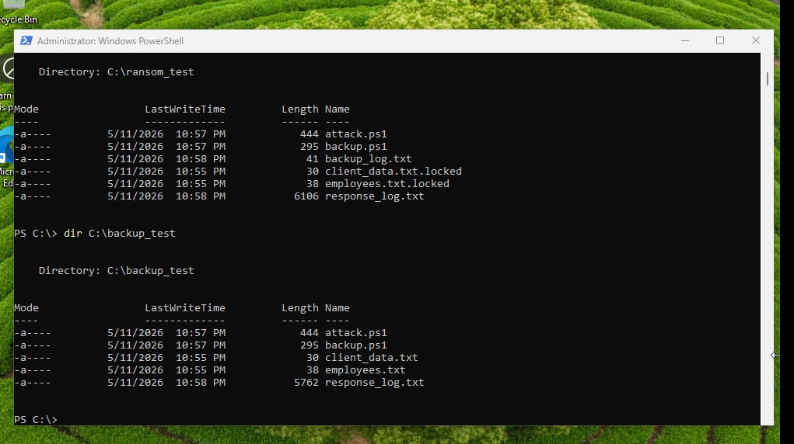
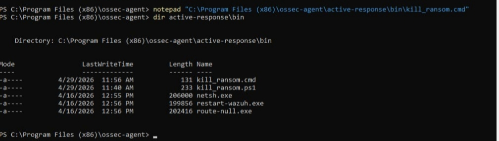

# 🛡️ Ransomware Threat Detection and Automated Response System using Wazuh SIEM

## 📌 Project Overview

This project demonstrates the design and implementation of an intelligent ransomware detection and automated response system using Wazuh SIEM. The lab environment was built using Ubuntu Server, Windows 11, and Kali Linux in VMware Workstation.

The objective of this project is to detect ransomware activities, monitor endpoint behavior, generate real-time security alerts, and automatically respond to suspicious events using PowerShell automation and Python scripts.

---

# 🏗️ System Architecture

<p align="center">
  
</p>

The architecture demonstrates how the ransomware simulation is detected using Wazuh SIEM. The Windows endpoint is continuously monitored through the Wazuh Agent, PowerShell scripts, Python-based behavioral analysis, and SHA-256 File Integrity Monitoring (FIM). When suspicious activity is detected, an automated response is triggered to stop the malicious process, isolate the endpoint, notify the security analyst through Telegram, and generate alerts on the Wazuh Dashboard for incident investigation.

---

## 🎯 Objectives

- Detect ransomware behavior in real time.
- Monitor Windows endpoints using Wazuh Agent.
- Generate security alerts for suspicious activities.
- Perform SHA-256 file integrity monitoring.
- Detect abnormal CPU utilization.
- Send Telegram notifications during attacks.
- Automatically isolate compromised systems.
- Simulate ransomware safely in a virtual lab.

---

## 🏗️ Lab Environment

| Machine | Purpose |
|----------|----------|
| Ubuntu Server | Wazuh Manager |
| Windows 11 | Victim Machine |
| Kali Linux | Attack Machine |
| VMware Workstation | Virtualization Platform |

---

## 🛠️ Technologies Used

- Wazuh SIEM
- Ubuntu Server
- Windows 11
- Kali Linux
- VMware Workstation
- PowerShell
- Python
- SHA-256 File Integrity Monitoring
- Active Response
- Telegram Bot API
- MITRE ATT&CK Framework
- Windows Event Logs

---

## ✨ Features

- Real-time ransomware detection
- Endpoint monitoring using Wazuh
- SHA-256 file integrity verification
- CPU usage monitoring
- Telegram alert notifications
- Automated network isolation
- Security log analysis
- Safe ransomware simulation

---

## 📂 Project Structure

```text
docs/
    Project_Report.pdf

diagrams/
    Architecture_Diagram.png

screenshots/
    01_Wazuh_Dashboard_Overview.png
    02_Wazuh_Agent_Status.png
    03_Kali_HTTP_Server.png
    04_Ransom_Test_Setup.png
    05_Ransomware_Attack_Execution.png
    06_Encrypted_Locked_Files.png
    07_Backup_Recovery.png
    08_File_Integrity_Monitoring.png

README.md
LICENSE
```

---

## 🔄 Project Workflow

1. Configure Ubuntu Server as Wazuh Manager.
2. Connect Windows 11 endpoint using Wazuh Agent.
3. Launch ransomware simulation from Kali Linux.
4. Monitor endpoint activities.
5. Detect suspicious file modifications.
6. Verify file integrity using SHA-256 hashing.
7. Trigger Active Response.
8. Generate security alerts.
9. Recover files using backup script.

---

# 📸 Project Screenshots

## 1. Wazuh Dashboard Overview



---

## 2. Wazuh Agent Status


---

## 3. Kali HTTP Server


---

## 4. Ransom Test Setup


---

## 5. Ransomware Attack Execution



---

## 6. Encrypted (.locked) Files


---

## 7. Backup Recovery



---

## 8. File Integrity Monitoring


---

## 💡 Skills Demonstrated

- Security Monitoring
- Endpoint Detection
- SIEM Administration
- Incident Response
- File Integrity Monitoring
- PowerShell Automation
- Python Scripting
- Linux Administration
- Windows Security
- Threat Detection
- MITRE ATT&CK

---

## 🚀 Future Improvements

- Integrate Sysmon for enhanced telemetry
- Add Sigma detection rules
- Integrate VirusTotal API
- Deploy Wazuh Cluster
- Support email notifications
- Automate IOC enrichment

---

## ⚠️ Disclaimer

This project was developed in a controlled virtual lab environment for educational and research purposes only. No real systems were targeted.

---

## 👨‍💻 Author

**Mohan Sekar**

Cyber Security | SOC Analyst | Blue Team | Wazuh SIEM | Incident Response

**GitHub:** https://github.com/Mohan-161
